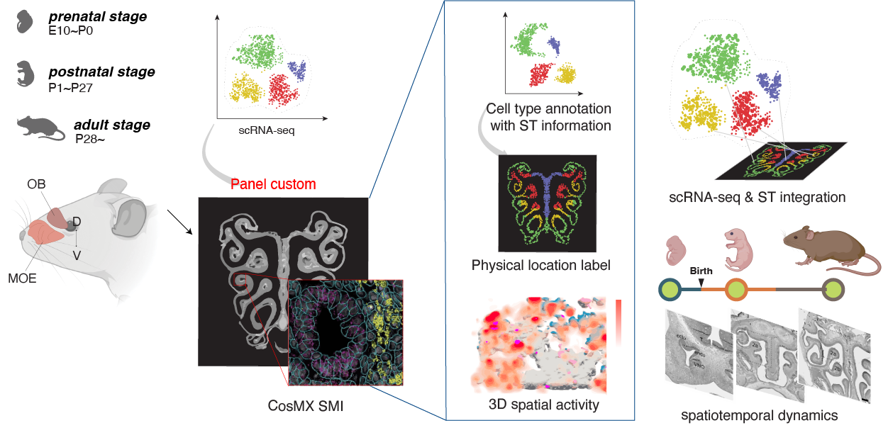

#  Research

## Elucidate Olfactory Map Formation Mechanism with Molecular Basis
The sense of smell serves variety of important functions in everyday life. The olfactory features are likely carried out by distinct functional networks of topographic map of ORs which are reffered as '**zone**'. The zonal organization in OE is initially formed in early developmental stages but reorganized during postnatal state also. With **spatiotemporal profiling** of spatial & single cell level gene expression information, we urge to investigate **molecular basis of olfactory map formation mechanism** in OE.





## More



## More

