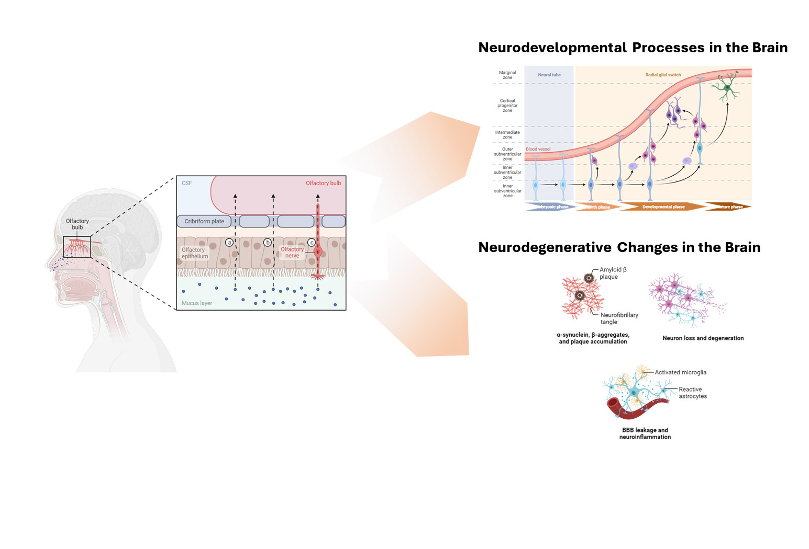
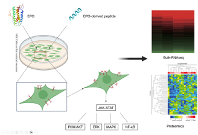

#  Research

## Beyond Smell: The Profound Influence of the Olfactory Connection on Brain Processes

The olfactory epithelium establishes a complex relationship with the central nervous system, directly interfacing via a singular synaptic connection. This intricate interlinkage has been progressively illuminated to profoundly influence various functions and diverse processes within the brain. The routes and mechanisms through which olfactory neurons impact the brain's structure and functionality are multifaceted. In our laboratory, we are rigorously investigating these influences, taking into account both the physical connections and molecular dynamics between the olfactory epithelium and the brain.



## Elucidate Olfactory Map Formation Mechanism with Molecular Basis
The sense of smell serves variety of important functions in everyday life. The olfactory features are likely carried out by distinct functional networks of topographic map of ORs which are reffered as '**zone**'. The zonal organization in OE is initially formed in early developmental stages but reorganized during postnatal state also. With **spatiotemporal profiling** of spatial & single cell level gene expression information, we urge to investigate **molecular basis of olfactory map formation mechanism** in OE.



## Prediction structure and Measurement of Kd Value between Receptor and Peptide
The structure of proteins is a critical determinant of their function. In silico methods are employed to ascertain the binding between receptors and ligands, predicting various structural changes and binding affinities that ensue.
This project involves predicting the structures of the Erythropoietin Receptor and Erythropoietin- derived Peptide. It encompasses anticipating the receptor-ligand complex structure and the binding affinity upon docking. Furthermore, leveraging the predictions, in vitro experiments such as Nano ITC are conducted to validate the differences in signaling activity resulting from structural changes in the Epo Receptor.



## Comparative Analysis of EPO and EPO-Derived Peptides: Insights into Signaling Pathway
Initially known for its hematopoietic role, Erythropoietin (EPO) has garnered attention for its tissue-protective function, particularly in the nervous system, as confirmed by global research over the past two decades. Moreover, in clinical trials, the use of EPO for neurological disorders often leads to side effects like erythropoiesis. Hence, the neuroprotective EPO-derived peptides, which lack hematopoietic effects, have gained significant attention. Furthermore, these peptides exhibit distinct binding modes to the receptor and varying degrees of downstream signaling pathway activation compared to EPO. Therefore, we aim to employ bioinformatics approaches such as Bulk-RNAseq and proteomics to conduct a comparative analysis at the RNA and protein levels of downstream signaling pathways. This endeavor seeks to provide a deeper understanding of the modulation of downstream signaling pathways. The experiments are predominantly conducted in HEK cells and primary cultured rat cortical cells.


## CDS biomarker study - Diagnostic study in veterinary neurodegenerative diseases

Cognitive dysfunction syndrome(CDS, also known as canine cognitive disorder) is a condition that occurs in elderly dogs and shows **clinically similar patterns to human neurodegenerative disorders**. However, there is currently no objective or precise diagnostic method for CDS, and much more needs to be learned about the condition.
Our goal is to discover **biomarkers** that enable objective diagnosis of CDS. Based on the hypothesis that CDS shares similar features with human neurodegenerative diseases, and taking the **pathological correlation between brain and nose** into consideration, we aim to utilize proteomics to discover and validate biomarkers in nasal discharge of dogs.



## Olfactory Receptors in Immune Cells: Sensing and Responding to Environmental Stimuli

The olfactory system detects external environmental stimuli as chemical signals through olfactory receptors and induces appropriate responses. Similarly, the immune system triggers immune responses through immune cells that express chemosensory receptors. Olfactory receptors are one type of chemosensory receptors, and immune cells that express them have been sometimes reported recently. We search for immune cells that reside in the olfactory system, study their functions and roles, and also investigate whether they can directly sense external environmental stimuli and elicit systematic responses.
